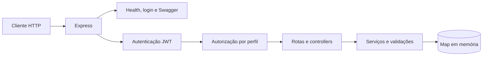
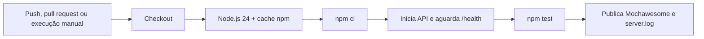

<div align="center">

# Motos na Web — API REST de Motocicletas

API de portfólio construída para praticar desenvolvimento, documentação e diferentes abordagens de teste de software em uma API REST.

[](https://github.com/cmls-gama/motos-na-web-api/actions/workflows/main.yml)


[Documentação da Wiki](https://github.com/cmls-gama/motos-na-web-api/wiki/Motos-na-Web-%E2%80%90-APIs) · [Execuções da CI](https://github.com/cmls-gama/motos-na-web-api/actions/workflows/main.yml) · [Issues](https://github.com/cmls-gama/motos-na-web-api/issues)

</div>

[testes12]

## Sobre o projeto

O projeto implementa um CRUD de motocicletas protegido por autenticação JWT e autorização por perfil. Além da API, o repositório reúne contrato OpenAPI, testes automatizados de integração, testes de performance com k6 e um workflow de integração contínua com publicação de evidências.

### Destaques do portfólio

- CRUD completo de motocicletas com autenticação e controle de acesso por perfil.
- Contrato OpenAPI 3.0.3 e Swagger UI para exploração dos endpoints.
- 26 testes automatizados com Mocha, Chai, SuperTest e relatório Mochawesome.
- Dois cenários de performance com k6: smoke do health check e carga no cadastro de motocicletas.
- 25 casos de teste manuais baseados na ISO 29119-3, técnicas de teste e heurística VADER.
- Três sessões exploratórias de 30 minutos documentadas com abordagem SBTM.
- Pipeline no GitHub Actions para executar a regressão e armazenar relatório e log por 7 dias.

> A estratégia, os artefatos de teste e o workflow estão detalhados na [Wiki do projeto](https://github.com/cmls-gama/motos-na-web-api/wiki/Motos-na-Web-%E2%80%90-APIs).

## Funcionalidades

- Login com emissão de token JWT.
- Perfil `manager`: cria, consulta, edita e remove motocicletas.
- Perfil `user`: consulta a coleção e os detalhes de motocicletas.
- Validação de campos obrigatórios, tipos, limites e propriedades não permitidas.
- Erros padronizados no formato `{ "error": "mensagem" }`.
- Armazenamento em memória com `Map`.
- Health check em `/health`.
- Swagger UI em `/api-docs` e contrato JSON em `/api-docs.json`.

## Arquitetura



As responsabilidades são separadas entre rotas, controllers, serviços, middlewares e modelo. Os registros são mantidos apenas durante a execução; reiniciar a aplicação recria a massa inicial definida em `src/server.js`.

## Endpoints

| Método | Endpoint | Acesso | Finalidade |
| --- | --- | --- | --- |
| `GET` | `/health` | Público | Verificar disponibilidade da API |
| `POST` | `/api/auth/login` | Público | Autenticar e emitir o JWT |
| `GET` | `/api/motorcycles` | `manager` ou `user` | Listar motocicletas |
| `GET` | `/api/motorcycles/:id` | `manager` ou `user` | Consultar uma motocicleta |
| `POST` | `/api/motorcycles` | `manager` | Cadastrar uma motocicleta |
| `PUT` | `/api/motorcycles/:id` | `manager` | Atualizar uma motocicleta |
| `DELETE` | `/api/motorcycles/:id` | `manager` | Remover uma motocicleta |
| `GET` | `/api-docs` | Público | Abrir o Swagger UI |
| `GET` | `/api-docs.json` | Público | Consultar o contrato OpenAPI |

Exemplo de payload:

```json
{
  "brand": "Honda",
  "model": "CB 500F",
  "year": 2025,
  "color": "Vermelha",
  "engineCapacityCc": 471
}
```

A criação e as consultas por ID respondem com `{ "data": { ... } }`. A listagem responde com `{ "data": [...], "count": 1 }`. Uma exclusão bem-sucedida retorna `204` sem corpo.

## Tecnologias e ferramentas

| Área | Tecnologias |
| --- | --- |
| API | Node.js, Express e JavaScript CommonJS |
| Segurança | JSON Web Token e `scrypt` do Node.js |
| Documentação | OpenAPI 3.0.3 e Swagger UI Express |
| Testes de API | Mocha, Chai e SuperTest |
| Relatórios | Mochawesome |
| Performance | k6 |
| Integração contínua | GitHub Actions |

## Como executar

### Pré-requisitos

- Node.js 18 ou superior.
- npm.
- k6 apenas para os testes de performance.

### Instalação

```bash
git clone https://github.com/cmls-gama/motos-na-web-api.git
cd motos-na-web-api
npm install
```

### Configuração

A aplicação possui valores padrão para demonstração local. Para sobrescrevê-los, crie um arquivo `.env` na raiz — esse arquivo não é versionado — usando as variáveis reconhecidas pelo projeto:

```dotenv
PORT=3000
JWT_SECRET=substitua-por-uma-chave-segura
JWT_EXPIRES_IN=1h
MANAGER_USERNAME=gerente
MANAGER_PASSWORD=gerente123
USER_USERNAME=usuario
USER_PASSWORD=usuario123
```

### Inicialização

```bash
npm start
```

Para executar com recarga automática:

```bash
npm run dev
```

Com a porta padrão, a API estará em `http://localhost:3000` e o Swagger em `http://localhost:3000/api-docs`.

### Credenciais locais padrão

| Perfil | Usuário | Senha | Permissões |
| --- | --- | --- | --- |
| Gerente | `gerente` | `gerente123` | Leitura e escrita |
| Usuário | `usuario` | `usuario123` | Somente leitura |

Faça login e envie o token retornado nas rotas protegidas com o cabeçalho `Authorization: Bearer <token>`.

## Estratégia de testes

### Testes automatizados de API

A suíte possui 26 testes distribuídos da seguinte forma:

| Suíte | Quantidade | Cobertura implementada |
| --- | ---: | --- |
| Autenticação | 2 | Login válido dos perfis `manager` e `user` |
| GET | 8 | Listagem, consulta por ID, perfis, autenticação e erros `404`/`500` |
| POST | 5 | Criação, payload inválido, autenticação, autorização e erro `500` |
| PUT | 5 | Atualização, corpo vazio, autenticação, autorização e `404` |
| DELETE | 5 | Exclusão, autenticação, autorização, `404` e erro `500` |
| Health check | 1 | Status `200` e corpo `{ "status": "ok" }` |

Os testes fazem requisições para `BASE_URL` — por padrão, `http://localhost:3000`. Portanto, execute a API em um terminal e a suíte em outro:

```bash
# terminal 1
npm start

# terminal 2
npm test
```

O Mochawesome grava os resultados em `mochawesome-report/`.

### Testes de performance

Os dois scripts exigem que a API esteja em execução e aceitam a variável `BASE_URL` para substituir `http://localhost:3000`.

| Cenário | Arquivo | Configuração e critérios |
| --- | --- | --- |
| Smoke do health check | `performance/k6/health-smoke.js` | 1 VU por 5 s; falhas `< 1%`, p95 `< 500 ms` e checks em `100%` |
| Carga no cadastro | `performance/k6/post-motorcycles.test.js` | Estágios de 10, 10, 30 e 0 VUs ao longo de 60 s; p90 `< 3 s`, máximo `< 5 s`, falhas `< 1%` e checks em `100%` |

Execução:

```bash
npm run test:performance:health
k6 run performance/k6/post-motorcycles.test.js
```

No cenário de cadastro, cada iteração autentica o gerente, envia um `POST /api/motorcycles` e verifica o status `201`, o token e o ID criado.

> O workflow atual não executa os scripts k6; os testes de performance são iniciados separadamente pelos comandos acima.

### Testes manuais e exploratórios

Os artefatos analisados na pasta local `testware` registram:

- plano de testes da API REST, versão 1.0;
- 25 casos manuais para autenticação, listagem e cadastro, estruturados com referência à ISO 29119-3 e à heurística VADER;
- três relatórios de sessão exploratória SBTM para `GET`, `PUT` e `DELETE /api/motorcycles/:id`, com 30 minutos cada;
- registro de achados nos [issues do repositório](https://github.com/cmls-gama/motos-na-web-api/issues).

O conteúdo consolidado e a rastreabilidade desses artefatos estão na [Wiki](https://github.com/cmls-gama/motos-na-web-api/wiki/Motos-na-Web-%E2%80%90-APIs).

## Integração contínua

O workflow [`Motos-na-Web-API-CI`](.github/workflows/main.yml) é acionado manualmente, em pull requests para `main` e em pushes para `main`.



O job usa `ubuntu-latest`, tem timeout de 10 minutos e executa `npm ci` antes de iniciar a API. A publicação do artefato `relatorio-mochawesome` usa `if: always()`, portanto tenta preservar relatório e log mesmo quando uma etapa anterior falha. A retenção configurada é de 7 dias.

O pipeline atual executa a suíte `npm test`; os cenários k6 não estão incluídos no workflow.

Execuções simultâneas da mesma referência são controladas por `concurrency`; uma execução anterior ainda em andamento é cancelada quando outra é iniciada.

Consulte a explicação completa na [Wiki](https://github.com/cmls-gama/motos-na-web-api/wiki/Motos-na-Web-%E2%80%90-APIs#integra%C3%A7%C3%A3o-cont%C3%ADnua-com-github-actions).

## Estrutura do repositório

```text
.github/
  ISSUE_TEMPLATE/             # Templates de bug e melhoria
  workflows/main.yml          # Pipeline da API
performance/
  config/                     # URL local utilizada pelo k6
  helpers/                    # Autenticação para o cenário de cadastro
  k6/                         # Smoke e teste de carga
  utils/                      # Leitura da BASE_URL
resources/
  openapi.json                # Contrato OpenAPI 3.0.3
src/
  config/                     # Usuários locais e derivação das senhas
  controllers/                # Entrada HTTP e respostas
  middlewares/                # JWT, autorização e tratamento de erros
  models/                     # Entidade e Map em memória
  routes/                     # Endpoints
  services/                   # Regras de negócio e validações
  app.js                      # Configuração do Express
  server.js                   # Massa inicial e inicialização
test/
  fixtures/                   # Payloads usados nos testes
  helpers/                    # Autenticação e criação de massa
  *.test.js                   # 26 testes automatizados
```

## Limitações conhecidas

- Não há banco de dados persistente: os registros são armazenados em um `Map` e são recriados quando o processo reinicia.
- Os usuários são locais e definidos durante a inicialização da aplicação.
- As credenciais e a chave JWT padrão existem para demonstração; outros ambientes devem sobrescrevê-las por configuração segura.

## Documentação e acompanhamento

- [Wiki — estratégia, artefatos e CI](https://github.com/cmls-gama/motos-na-web-api/wiki/Motos-na-Web-%E2%80%90-APIs)
- [Contrato OpenAPI](resources/openapi.json)
- [Workflow do GitHub Actions](.github/workflows/main.yml)
- [Execuções do workflow](https://github.com/cmls-gama/motos-na-web-api/actions/workflows/main.yml)
- [Issues e achados](https://github.com/cmls-gama/motos-na-web-api/issues)

---

<div align="center">

Projeto desenvolvido por [Caio Marques](https://github.com/cmls-gama) como portfólio da Mentoria 2.0 em Testes de Software.

</div>
